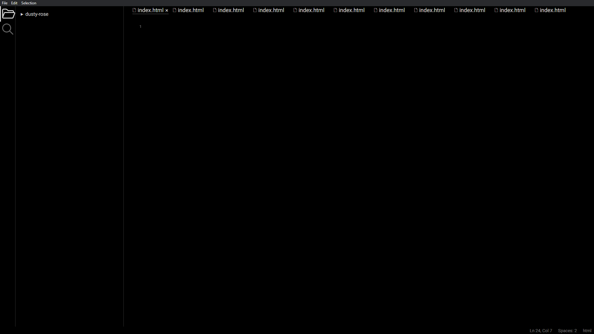

# Dusty Rose

Dusty Rose is a simple code editor which is built using ElectronJS.

## Screenshots



## Tech Stack

Electronjs, Typescript, Sass

## Run Locally

Clone the project

```bash
  git clone git@github.com:zs3olkusz/dusty-rose.git
```

Go to the project directory

```bash
  cd dusty-rose
```

Install dependencies

```bash
  npm install
```

Start the server

```bash
  npm run start
```

<!-- ## Running Tests

To run tests, run the following command

```bash
  npm run test
``` -->

## Authors

- [@damiankocjan](https://www.github.com/damiankocjan)

<!-- ## Contributing

Contributions are always welcome!

See `contributing.md` for ways to get started.

Please adhere to this project's `code of conduct`. -->

## License

[MIT](https://github.com/zs3olkusz/dusty-rose/blob/main/LICENSE)
